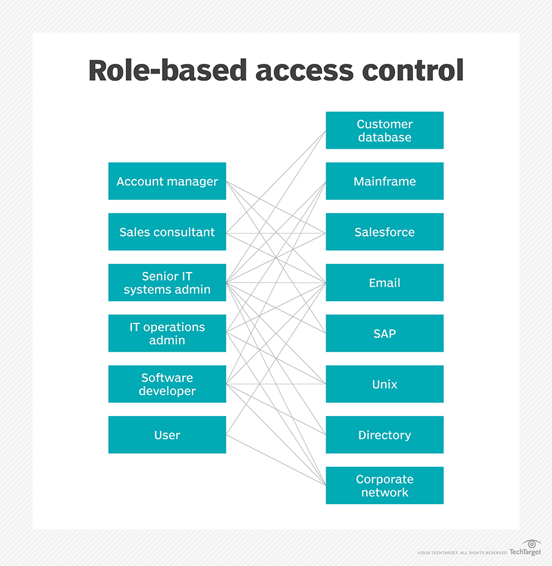

# golang-RBAC-system
## 方法
### /user
方法名 | 入参 | 使用方法 |  介绍  | 请求方式
:-:|:-:|:-:|:-:|:-:
GetAllUsers | 无 | /getAllUsers | 得到所有用户 | GET
GetAllRolesOfUser | userName | /getAllRolesOfUser/{userName} | 得到一个用户的所有角色 | GET
GetAllPermsOfUser | userName | /getAllPermsOfUser/{userName} | 得到一个用户的所有权限 | GET
IsPrmitted | userName,permName | /isPrmitted/{userName}/{permName} | 查询用户是否有指定权限 | GET
Create | userId, userName(JSON) | /create | 创建用户 | POST
AddRole | userName, roleName(JSON) | /addRole | 为一个用户添加角色 | POST
DeleteById | userId(JSON) | /deleteById | 通过用户ID删除一个用户 | DELETE
DeleteByName | userName(JSON) | /deleteByName | 通过用户名称删除一个用户 | DELETE
DeleteRole | userName,roleName(JSON) | /deleteRole | 删除一个用户的指定角色 | DELETE

### /role
方法名 | 入参 | 使用方法 |  介绍  | 请求方式
:-:|:-:|:-:|:-:|:-:
GetAllRoles | 无 | /getAllRoles | 得到所有角色 | GET
GetAllPermsOfRole | roleName | /getAllPermsOfRole/{roleName} | 得到一个角色的所有权限 | GET
Create | roleId, roleName(JSON) | /create | 创建角色 | POST
AddPerm | roleName, permName(JSON) | /addPerm | 为一个角色添加权限 | POST
DeleteById | roleId(JSON) | /deleteById | 通过角色ID删除一个角色 | DELETE
DeleteByName | roleName(JSON) | /deleteByName | 通过角色名称删除一个角色 | DELETE
DeletePerm | roleName, permName(JSON) | /deletePerm | 删除一个角色的指定用户 | DELETE

### /perm
方法名 | 入参 | 使用方法 |  介绍  | 请求方式
:-:|:-:|:-:|:-:|:-:
GetAllPerms | 无 | /getAllPerms | 得到所有权限 | GET
Create | permId, permName(JSON) | /create | 创建权限 | POST
DeleteById | permId(JSON) | /deleteById | 通过权限ID删除一个权限 | DELETE
DeleteByName | permName(JSON) | /deleteByName | 通过权限名称删除一个权限 | DELETE

## 数据初始化

用户名 | 用户角色
:-:|:-:
A | Account manager
B | Sales consultant
C | Senior IT systems admin
D | Software developer
E | User, Sales consultant
F | IT operations admin
